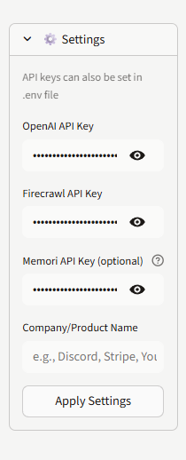
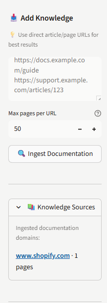
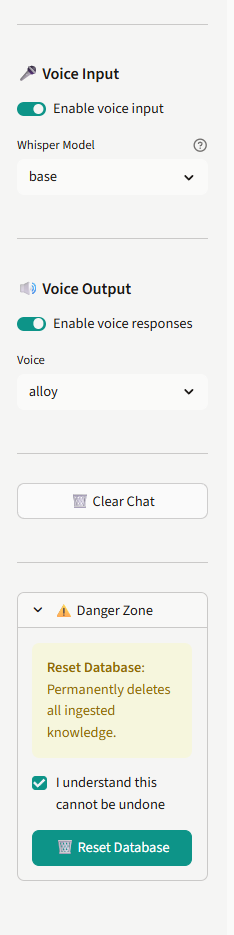
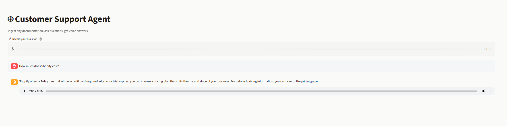

# Voice-Enabled Support Agent

A Streamlit application that crawls documentation, stores it in a searchable knowledge base, and provides interactive support through text and voice interfaces.

**[Try the Live Demo](https://krunalscustomersupportagent.streamlit.app/)**

## Screenshots

**Full Application Overview**


**Settings & API Configuration**


**Knowledge Sources**


**Voice Input & Output**


**Question Answering**


## Features

- Documentation crawling and ingestion from any URL
- Voice input via local Whisper speech-to-text
- Voice output using OpenAI text-to-speech
- Persistent SQLite knowledge base with semantic search
- Context-aware responses powered by GPT-4o-mini

## Tech Stack

- [Streamlit](https://streamlit.io/) - Web application framework
- [Firecrawl](https://firecrawl.dev/) - Documentation crawling
- [Memori](https://github.com/MemoriLabs/Memori) - Semantic memory and retrieval
- [OpenAI](https://platform.openai.com/docs/models) - GPT-4o-mini for chat, TTS for voice
- [Faster-Whisper](https://github.com/SYSTRAN/faster-whisper) - Speech recognition

## Requirements

- Python 3.10+
- OpenAI API key
- Firecrawl API key
- Memori API key (optional)

## Installation

1. Clone the repository

   ```bash
   git clone <your-repo-url>
   cd Support_Agent
   ```

2. Install dependencies

   ```bash
   pip install -r requirements.txt
   ```

3. Configure environment variables

   Copy the template:

   ```bash
   cp env.template .env
   ```

   Edit `.env` with your API keys:

   ```
   OPENAI_API_KEY=sk-...
   FIRECRAWL_API_KEY=fc-...
   MEMORI_API_KEY=...           # optional
   SQLITE_DB_PATH=./support.sqlite
   ```

   Alternatively, you can enter API keys directly in the app sidebar.

## Usage

Start the application:

```bash
streamlit run app.py
```

Then:

1. Configure API keys in the sidebar (if not using `.env`)
2. Set your company/product name for context
3. Paste documentation URLs and click "Ingest Documentation"
4. Ask questions via text or voice

## Project Structure

```
Support_Agent/
├── app.py                    # Main application
├── requirements.txt          # Dependencies
├── env.template             # Environment template
├── .gitignore              # Git ignore rules
├── .streamlit/
│   └── config.toml          # UI theme configuration
├── screenshots/             # Application screenshots
│   ├── FullPageExample.png
│   ├── Settings.png
│   ├── Knowledge.png
│   ├── VoiceInputOutput.png
│   └── AnswerQuestion.png
├── README.md               # Documentation
├── support.sqlite          # Knowledge base (auto-created)
└── knowledge_sources.json  # Source metadata (auto-created)
```

## Deployment

This app is deployed on [Streamlit Community Cloud](https://krunalscustomersupportagent.streamlit.app/).

**Deploy your own instance:**

1. Fork this repository
2. Sign up at [share.streamlit.io](https://share.streamlit.io/)
3. Connect your GitHub account
4. Deploy from your forked repo
5. **Important:** Don't add secrets in Streamlit Cloud settings - users will provide their own API keys via the sidebar

The app automatically requires users to enter their own API keys, protecting your usage limits.

## Troubleshooting

**API key errors**

- Verify keys are set in `.env` or sidebar
- Restart the app after updating `.env`

**Voice input issues**

- Check browser microphone permissions
- Verify Whisper model downloaded successfully

**Slow performance**

- Use smaller Whisper models (tiny/base)
- Reduce pages per URL limit
- Check OpenAI API rate limits
